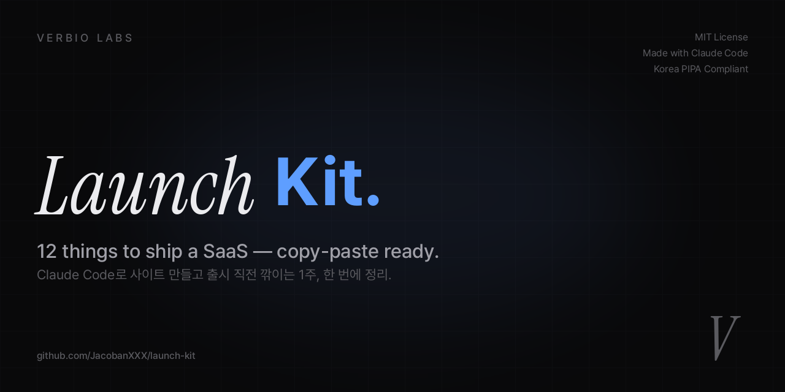

<div align="center">



# Launch Kit

**Stop forgetting these 12 things every time you ship a SaaS.**

Claude Code로 사이트 만들고 출시 직전 깎이는 1주, 한 번에 정리.<br>
한국 PIPA·전자상거래법 호환 약관 + 모바일 햄버거 + SEO + Analytics + … 다 포함.

🇰🇷 한국어 (현재) · [🇺🇸 English](README.en.md)

[](LICENSE)
[](https://claude.ai/code)
[](legal/)
[](https://github.com/JacobanXXX/launch-kit/stargazers)
[](https://github.com/JacobanXXX/launch-kit/network/members)
[](CONTRIBUTING.md)
[](CODE_OF_CONDUCT.md)

[**🚀 Quick Start**](#-quick-start) · [**📋 Checklist**](#-12-item-pre-launch-checklist) · [**💎 What's Inside**](#-whats-inside) · [**🤔 FAQ**](#-faq) · [**🤝 Contribute**](CONTRIBUTING.md)

</div>

---

## 👥 Built for these vibe coders

<table>
<tr>
<td width="33%" align="center">
  <h3>🛠 1인 인디 메이커</h3>
  <p>Cursor·Claude Code로 혼자 사이트·SaaS 만드는 분.<br>출시 직전 매번 같은 함정 12개에 깎임.</p>
</td>
<td width="33%" align="center">
  <h3>🇰🇷 한국 SaaS 창업자</h3>
  <p>전자상거래법·PIPA 약관 0에서 작성하기 막막.<br>변호사 50만원 견적 부담.</p>
</td>
<td width="33%" align="center">
  <h3>⚡ 주말 해커</h3>
  <p>금요일 시작 → 일요일 출시 목표.<br>UX·SEO·Analytics 학습 시간 X.</p>
</td>
</tr>
</table>

---

## 🤔 Why this exists?

> **"Claude Code로 사이트 만드는 데 30분.<br>
> 출시 가능한 상태까지 가는 데 1주."**

verbiolabs.com 만들면서 이거 5번 겪었습니다. 매번 같은 함정에 빠짐:

- 모바일에서 메뉴가 사라짐 → 햄버거 없음
- 카톡 링크에 썸네일이 텍스트만 → OG 이미지 없음
- 구글에 검색해도 안 나옴 → sitemap 없음
- 누가 방문하는지 모름 → analytics 없음
- 약관 만들어달라고 변호사 친구한테 부탁 → 견적 50만원
- ...

이거 한 항목씩 검색·해결하면 1주 깎입니다. 한 곳에 정리.

이 repo는 **다음 인디 메이커가 같은 시간 안 깎이게** 만들었습니다.

---

## 🗂  Architecture

```
launch-kit/
├── 📋 README.md                   ← you are here
├── ✅ checklist.md                ← 12-item pre-launch checklist
├── 🤖 claude.md                   ← Universal AI coding rules
├── 📜 LICENSE                     ← MIT
│
├── 🏛️  legal/                     ← 한국 PIPA·전자상거래법 호환
│   ├── privacy.html.template
│   ├── terms.html.template
│   └── refund.html.template
│
├── 🔍  seo/                       ← 검색 노출 풀세트
│   ├── sitemap.xml.template
│   ├── robots.txt
│   ├── jsonld-organization.json
│   └── google-search-console.md
│
├── 📊  analytics/                 ← Microsoft Clarity (무료, 무제한)
│   └── clarity.html
│
├── 🎨  components/                ← UI/UX copy-paste 코드
│   ├── mobile-hamburger.html
│   ├── 404.html
│   ├── app-store-badge.html
│   ├── a11y.css
│   └── og-image-generator.py
│
├── 📣  threads-posts.md           ← 마케팅 카피 8종 (Threads 최적화)
├── 🤝  CONTRIBUTING.md            ← PR 환영 가이드
├── 🛡️  SECURITY.md                ← 취약점 신고
├── 💛  CODE_OF_CONDUCT.md         ← Contributor Covenant 2.1
├── 📝  CHANGELOG.md
└── 🏗️  .github/                   ← Issue·PR 템플릿, Actions
```

---

## 📦 What's inside?

| Category | Files | What you get |
|---|---|---|
| 🏛️  **Legal** | `privacy.html.template` `terms.html.template` `refund.html.template` | 한국 PIPA·전자상거래법 호환 약관 3종 (변호사 견적 50만원 절약) |
| 🔍  **SEO** | `sitemap.xml.template` `robots.txt` `jsonld-organization.json` | 구글 검색 노출 풀세트 |
| 📊  **Analytics** | `clarity.html` | Microsoft Clarity 스니펫 (무료, 무제한, 히트맵 + 세션 녹화) |
| 🎨  **Components** | `mobile-hamburger.html` `404.html` `app-store-badge.html` `a11y.css` `og-image-generator.py` | 즉시 쓸 수 있는 UI 코드 |
| 🤖  **AI Workflow** | `claude.md` | Universal `claude.md` 템플릿 (Claude Code · Cursor · Aider 호환) |
| 💳  **Korean PG** | `legal/pg/*.md` `components/payment/*.html` | 토스페이먼츠·포트원·이니시스 약관 + 결제 코드 |
| ⚡  **CLI** | `cli/index.js` | `npx launch-kit init` 으로 본인 프로젝트 자동 생성 (0 deps) |

---

## 🚀 Quick Start

**한 줄로 본인 프로젝트 자동 생성** (강력 추천):

```bash
npx launch-kit init
```

→ 인터랙티브 prompt가 회사명·도메인·PG·Clarity ID 등 묻고, 모든 파일을 변수 치환해서 자동 생성. 5분이면 끝.

<details>
<summary><b>또는 수동 복사 (CLI 안 쓰고)</b></summary>

```bash
git clone https://github.com/JacobanXXX/launch-kit.git
cp -r launch-kit/legal ./your-project/
cp -r launch-kit/components ./your-project/
cp launch-kit/claude.md ./your-project/
# 그 후 legal/README.md 따라 변수 치환
```

또는 가장 자주 까먹는 모바일 햄버거 메뉴만:

```bash
curl -O https://raw.githubusercontent.com/JacobanXXX/launch-kit/main/components/mobile-hamburger.html
```

</details>

---

## 📋 12-Item Pre-Launch Checklist

| # | Item | 빠뜨리면 | Code |
|---|------|----------|------|
| 1 | **Mobile hamburger menu** | 모바일 사용자 페이지 끝까지 스크롤 | [components/mobile-hamburger.html](components/mobile-hamburger.html) |
| 2 | **Privacy / Terms / Refund** | 한국에서 결제 받으려면 법적 필수 | [legal/](legal/) |
| 3 | **OG image** | 카톡·페북 공유 시 썸네일 텍스트만 | [components/og-image-generator.py](components/og-image-generator.py) |
| 4 | **Favicon 풀세트** | 탭에 지구 아이콘 | [components/favicon/](components/favicon/) |
| 5 | **Microsoft Clarity** | 누가 어디서 이탈하는지 모름 | [analytics/clarity.html](analytics/clarity.html) |
| 6 | **Google Search Console + sitemap** | 구글 검색에 안 나옴 | [seo/google-search-console.md](seo/google-search-console.md) |
| 7 | **JSON-LD structured data** | 검색 결과에 로고 안 뜸 | [seo/jsonld-organization.json](seo/jsonld-organization.json) |
| 8 | **Brand 404 page** | Vercel/Netlify 기본 에러 페이지 | [components/404.html](components/404.html) |
| 9 | **`prefers-reduced-motion`** | 모션 민감 사용자 어지러움 | [components/a11y.css](components/a11y.css) |
| 10 | **App Store + Google Play badge** | 다운로드 버튼이 그냥 텍스트 링크 | [components/app-store-badge.html](components/app-store-badge.html) |
| 11 | **`canonical` + `robots` meta** | SEO 중복 콘텐츠 페널티 | 모든 페이지 `<head>` |
| 12 | **`claude.md` 잘 작성** | "왜 이걸 다 리팩토링했어?" 사고 발생 | [claude.md](claude.md) |

자세한 체크리스트 → [`checklist.md`](checklist.md)

---

## ⚖️ Comparison — Launch Kit vs Manual

| Task | Manual ⏰ | Launch Kit ⚡ |
|------|----------|---------------|
| 모바일 햄버거 메뉴 | 1-2일 (디버깅 포함) | **5분** (copy-paste) |
| 약관 3종 작성 | **50만원** (변호사) 또는 1주 (직접) | 10분 (변수 치환) |
| SEO 풀세트 | 1주 (학습 + 시행착오) | 30분 (템플릿) |
| OG 이미지 | 디자이너 외주 또는 Figma 작업 | Python 스크립트 1번 실행 |
| Analytics 설치 + 개인정보 disclosure | 반나절 | 5분 |
| 404 페이지 디자인 | 보통 미루다가 안 만듦 | 즉시 |
| 접근성 기본기 | 모르고 지나감 | CSS 1개 import |

**총 절약**: 평균 **1주 + 50만원** 💰

---

## 💡 How to use

<details>
<summary><b>Legal templates 사용하기 (한국 SaaS 필수)</b></summary>

```bash
# 1. 템플릿 복사
cp -r launch-kit/legal ./your-project/

# 2. 변수 치환 (예시)
cd your-project/legal
sed -i '' 's/{{COMPANY_BRAND}}/MyStartup/g' privacy.html.template
sed -i '' 's/{{DOMAIN}}/mystartup.com/g' privacy.html.template
# ... 나머지 변수도 동일하게

# 3. .template 확장자 제거
mv privacy.html.template privacy.html
mv terms.html.template terms.html
mv refund.html.template refund.html
```

치환할 변수 전체 목록 → [`legal/README.md`](legal/README.md)

⚠️ 강의·결제 본격 시작 전엔 변호사 1회 검토 추천.

</details>

<details>
<summary><b>모바일 햄버거 메뉴 적용하기</b></summary>

`components/mobile-hamburger.html` 안의 nav 영역 + CSS + JS를 본인 사이트에 통째로 복사.

CSS 변수만 본인 브랜드 색으로 바꾸면 끝:
```css
.nav { background: rgba(0,0,0,0.72); /* → 본인 브랜드 색 */ }
```

ESC 키 닫기, 클릭 시 자동 스크롤, body scroll lock 모두 포함.

</details>

<details>
<summary><b>Microsoft Clarity 설치 (5분)</b></summary>

1. https://clarity.microsoft.com 가입
2. + New project → 도메인 입력
3. 받은 프로젝트 ID로 `analytics/clarity.html`의 `{{CLARITY_PROJECT_ID}}` 치환
4. 모든 페이지 `<head>` 안에 붙여넣기
5. ⚠️ **개인정보처리방침에 Clarity 명시 필수** (이미 `legal/privacy.html.template`에 포함됨)

</details>

<details>
<summary><b>OG 이미지 자동 생성 (Python)</b></summary>

```bash
cd launch-kit/components
pip install pillow
python og-image-generator.py
```

본인 브랜드 컬러·폰트로 변경하려면 스크립트 안의 변수 수정.

</details>

---

## 🗺  Roadmap

- [x] Initial 12 items
- [x] Korean PIPA·전자상거래법 호환 약관 템플릿
- [x] Universal `claude.md` 템플릿
- [ ] Cursor `.cursorrules` 변형 추가
- [ ] 한국 PG사별 결제 모듈 약관 예시 (토스·이니시스·PortOne)
- [ ] English version of legal templates
- [ ] Video walkthrough (5분 setup)
- [ ] Next.js / Vite starter template integration
- [ ] CLI tool: `npx launch-kit init`

PR 환영 → [CONTRIBUTING.md](CONTRIBUTING.md)

---

## 🤔 FAQ

<details>
<summary><b>변호사 검토 없이 약관 그대로 써도 되나요?</b></summary>

⚠️ 일반적인 한국 SaaS 운영 기준으로 작성된 템플릿입니다.

- **개인 사이드 프로젝트** (결제 X, 회원가입 X) → 그대로 사용 OK
- **결제·구독·강의 판매 시작 전** → 변호사 1회 검토 권장 (10-30만원 비용으로 50만원짜리 처음부터 작성보다 훨씬 저렴)
- **B2B SaaS / 민감 데이터 처리** → 별도 검토 필수

이 템플릿은 변호사 검토의 **시작점**이지 대체재가 아닙니다.

</details>

<details>
<summary><b>Microsoft Clarity 진짜 무료인가요?</b></summary>

네. 무제한 무료. 광고 없음. 결제수단 등록 X.

대신:
- Microsoft가 익명화된 데이터를 자사 광고 모델 학습에 사용 가능 (옵트아웃 가능)
- 한국 PIPA 준수를 위해 **개인정보처리방침에 Microsoft Clarity 명시 필수** (template에 이미 포함)

</details>

<details>
<summary><b>Claude Code 안 쓰는데 사용 가능?</b></summary>

네. 이 kit의 90%는 일반 HTML/CSS/JS/Python이라 어떤 도구로도 사용 가능.

`claude.md`는 Cursor의 `.cursorrules`로 그대로 사용 가능. Aider, Continue 등 다른 AI 코딩 도구도 동일 패턴.

</details>

<details>
<summary><b>Next.js / React 프로젝트인데 HTML 템플릿이 의미 있나요?</b></summary>

물론. 약관은 어차피 정적 페이지. SEO meta는 `next/head`나 `<head>`에 그대로 옮기면 됨. 모바일 햄버거 컴포넌트는 React로 변환에 5분.

`claude.md`에 "Next.js App Router 쓰는 중" 한 줄 추가하면 Claude가 알아서 변환해줌.

</details>

<details>
<summary><b>왜 한국 specific 자료가 있나요?</b></summary>

- 한국에서 SaaS 출시하려면 전자상거래법·PIPA 호환 약관이 법적 필수
- 영어권 기존 launch kit들은 GDPR·CCPA만 다루고 한국 법령은 X
- 한국 vibe coder가 매번 0에서 작성해야 하는 부분
- → 그래서 묶었음

글로벌 사용자는 영어 부분만 쓰셔도 OK.

</details>

---

## 🌟 Made with Launch Kit

이 kit으로 만든 사이트들:

- 🌐 [verbiolabs.com](https://verbiolabs.com) — AI for human language. 부산 기반 1인 SaaS.

본인 사이트도 여기에! → README에 한 줄 추가하는 PR 환영.

---

## 📈 Star History

[](https://star-history.com/#JacobanXXX/launch-kit&Date)

⭐ Star로 momentum 만들어주세요. 다른 인디 메이커들이 발견하는 데 큰 도움이 됩니다.

---

## 🤝 Contributing

본인이 launch 직전에 마주친 함정 추가 환영!

자세한 가이드 → [CONTRIBUTING.md](CONTRIBUTING.md)

간단 버전:
1. Fork this repo
2. 본인 솔루션 추가 (해당 폴더)
3. README + checklist 업데이트
4. PR

---

## 📜 License

[MIT](LICENSE) — 자유롭게 가져다 쓰세요. attribution은 환영하지만 강제 X.

---

## ❤️ Made by

[**Jacob (안준영)**](https://verbiolabs.com) — 부산 기반 1인 SaaS 메이커. 5년간 식빵영어 운영 + AI 강의.

만드는 것:
- 🌐 [verbiolabs.com](https://verbiolabs.com) — AI for human language
- 📱 [TopikIQ](https://topikiq.com) — AI Korean for TOPIK ([App Store](https://apps.apple.com/kr/app/topikiq/id6761719529) · [Google Play](https://play.google.com/store/apps/details?id=com.topikiq.app))
- 🇰🇷 [Sikbang English](https://sikbang.co) — 5년차 영어 교육 브랜드 (4,600+ subscribers)

피드백·질문 환영:
- 🧵 Threads (DM 환영)
- 📧 hello@verbiolabs.com

---

<div align="center">

⭐ **Star this repo if it saved you a week** ⭐

이 repo가 1주 깎이지 않게 도와줬다면 별 하나 부탁드려요.<br>
다른 인디 메이커들이 발견하는 데 큰 도움이 됩니다.

</div>
